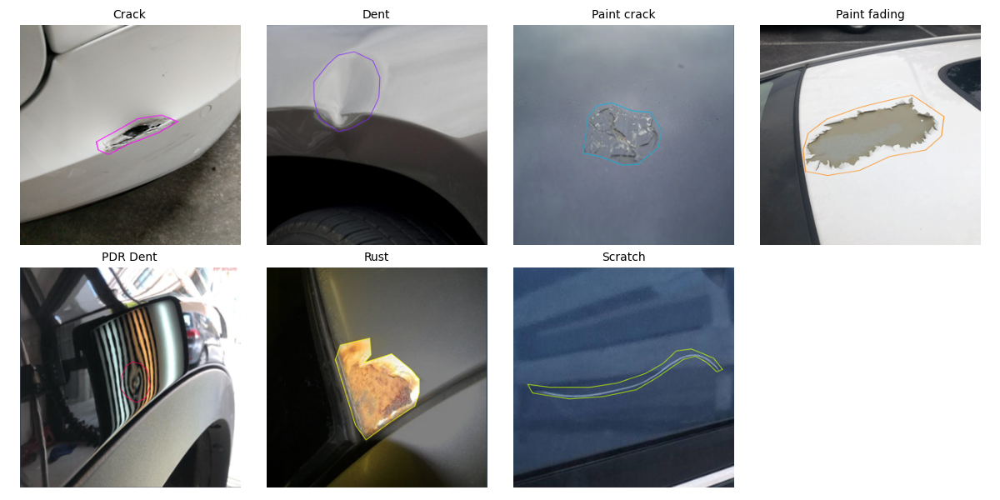
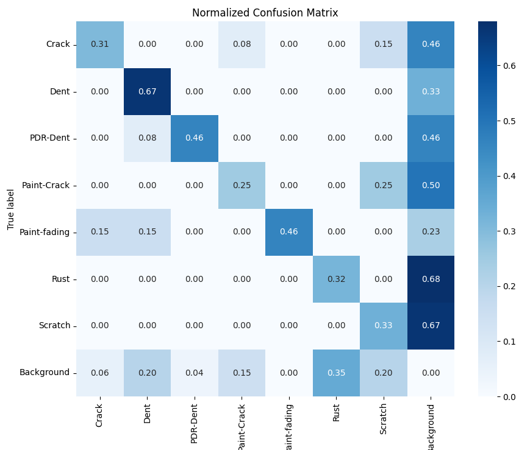
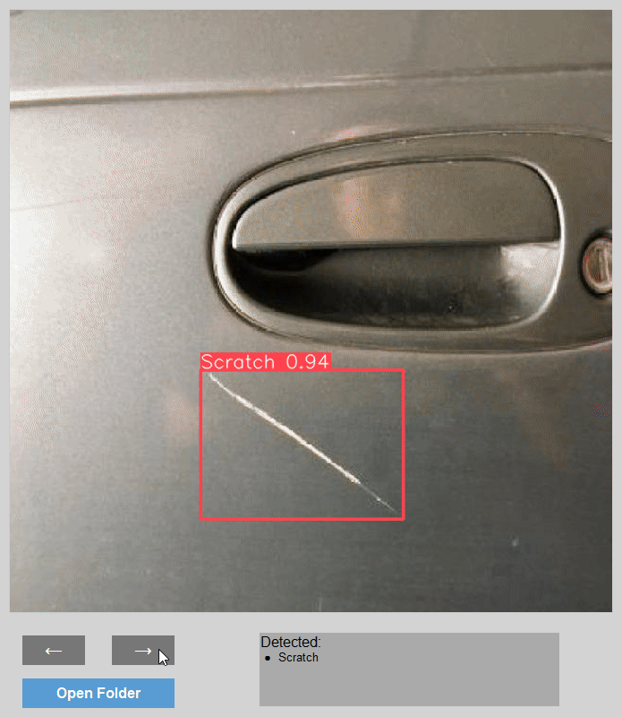

# Car Damage Detection

This project focuses on detecting and localizing various types of car body damages using deep learning models. It includes a custom YOLOv8 model and a Faster R-CNN model, along with a user-friendly application for image processing and visualization.

## Project Structure
The repository is organized as follows:
```
├── damage_detection_app/
│   ├── app.py               # Main script for the YOLO-based application.
│   ├── requirements.txt     # Required dependencies.
│   ├── README.md            # Instructions specific to the application.
│   └── test/                # Folder containing test images.
├── img/                     # Contains sample images and screenshots.
│   └── app_screen.png       # Example screenshot of the application in use.
├── training/
│   ├── YOLOv8.ipynb         # Jupyter notebook for training the YOLOv8 model.
│   └── Faster R-CNN.ipynb   # Jupyter notebook for training the Faster R-CNN model.
└── README.md                # Main instructions and overview of the project.
```

## Dataset
The dataset used for training contains images of car body damages, including classes such as scratches, rust, paint fading, paint cracks, dents, cracks, and PDR dents. It was created using the Roboflow platform and is available in two versions:
- **Without Data Augmentation**: 456 images.
- **With Data Augmentation**: 1140 images.

All images have been annotated using polygons to ensure high precision in labeling, which was a time-consuming but crucial process due to the relatively small dataset size. This precise annotation was necessary for effective model training.

You can access the dataset and more details on Roboflow here: [Roboflow Project Link](https://universe.roboflow.com/cardetecion/car-paint-damage-detection)

Below is an illustration of the dataset categories, showcasing the different types of car body damages used for training:




## Data Augmentation

To improve the model's generalization and handle the relatively small dataset, data augmentation techniques were applied. Each training example generated 3 augmented versions, using the following techniques:

- **Flip**: Horizontal and Vertical flipping
- **Rotation**: Random rotation between -15° and +15°
- **Saturation**: Adjusted between -35% and +35%
- **Cutout**: 10 random boxes, each covering 2% of the image area

Below is an example of an original image and its augmented version:


## Features
- **Dataset Creation**: High-quality image dataset with precise annotations using polygons.
- **Model Training**: Training of YOLOv8 and Faster R-CNN models using Google Colab.
- **Model Comparison**: Both models were trained and compared for their performance in detecting car body damages.
- **Application**: A Python application for detecting damages in images, with a graphical user interface (GUI) for easy navigation and result visualization.


## YOLOv8 Model

### YOLOv8 Model Configurations
The following table summarizes the different configurations used during the training of the YOLOv8 model:

| Pretrained Model | Dataset                  | Batch Size |
|------------------|--------------------------|------------|
| yolov8m          | Without Augmentation     | -1, 8, 16, 32 |
|                  | With Augmentation        | -1, 8, 16, 32 |

- **Pretrained Model**: The base YOLOv8 model used for transfer learning.
- **Dataset**: Indicates whether data augmentation techniques were applied during training.
- **Batch Size**: Different batch sizes tested during training. The value `-1` indicates the default batch size used by the model.

### YOLOv8 Model Training Results
Below are the training results for the best model configuration (with data augmentation and batch size of -1). The presented metrics include precision, total loss, mAP50, and a confusion matrix.

- **Precision**: The following graph shows the precision of the model across epochs:

   
- **Total Loss**: The total loss curve provides insights into how the model's loss decreased over training epochs:

   
- **mAP50**: The mean Average Precision at 50% IoU (mAP50) is shown below, indicating the model's ability to detect and classify damages:

   
- **Confusion Matrix**: The normalized confusion matrix shows the model's performance on the validation dataset, highlighting how well the model differentiates between different damage types:

   


## Conclusion

The best-performing configuration for the YOLOv8 model was achieved using data augmentation and the default batch size (`batch size = -1`). This outcome is logical, as data augmentation introduces more diversity into the dataset, helping the model better generalize to various types of car body damages. Additionally, using the default batch size allows the model to automatically adjust to an optimal size for the given dataset and training conditions, ensuring better convergence during training.


## Faster R-CNN Model

### Faster R-CNN Model Configurations
The following table outlines the configurations used for training the Faster R-CNN model:

| Data Type         | Pretrained Model              | Batch Size | Learning Rate | Batch Size per Image | Solver Steps | Solver Gamma |
|-------------------|-------------------------------|------------|---------------|---------------------|--------------|--------------|
| Without Augmentation | `faster_rcnn_R_50_FPN_3x`   | 8          | 0.001         | 512                 | -            | -            |
|                   | `faster_rcnn_R_50_FPN_3x`     | 8          | 0.001         | 512                 | 500, 800     | 0.5          |
|                   | `faster_rcnn_R_101_FPN_3x`    | 8          | 0.001         | 512                 | -            | -            |
|                   | `faster_rcnn_R_101_FPN_3x`    | 8          | 0.001         | 512                 | 500, 700     | 0.5          |
| With Augmentation | `faster_rcnn_R_50_FPN_3x`     | 8          | 0.001         | 512                 | -            | -            |
|                   | `faster_rcnn_R_50_FPN_3x`     | 8          | 0.001         | 512                 | 500          | 0.5          |
|                   | `faster_rcnn_R_101_FPN_3x`    | 8          | 0.001         | 512                 | -            | -            |
|                   | `faster_rcnn_R_101_FPN_3x`    | 8          | 0.001         | 512                 | 500          | 0.5          |

**Note**: The settings with specific solver steps and solver gamma values were applied to try to prevent overfitting during training.

### Faster R-CNN Model Training Results
Below are the training results for the Faster R-CNN model, showcasing various performance metrics, including mAP50, total loss, and a confusion matrix.

- **mAP50**: The following graph shows the mean Average Precision at 50% IoU (mAP50) across iterations, indicating the model's accuracy in detecting and classifying damages:

   
- **Total Loss**: The total loss curve illustrates how the loss function values changed throughout the training iterations:

   
- **Confusion Matrix**: The normalized confusion matrix represents the model's performance on the validation dataset, showing the accuracy of classification across various damage types:

   

## Conclusion
The Faster R-CNN model faced significant challenges with overfitting, both with and without data augmentation. The primary reason for this is the relatively small size of the dataset, which limited the model's ability to learn effectively without overfitting to the training data. Despite attempts to mitigate overfitting through strategies such as setting a low learning rate, adjusting solver steps, and using a gamma value to control learning rate decay, the model's performance did not improve substantially. This highlights the need for a larger dataset when using the Faster R-CNN architecture for similar tasks.


## Model Comparison: YOLO vs. Faster R-CNN
Below are the comparative results between the YOLO and Faster R-CNN models, showing the mAP50 and total loss metrics.

- **mAP50 Comparison**: This graph illustrates the mean Average Precision at 50% IoU (mAP50) over training epochs for both models, highlighting their accuracy in detecting and classifying damages:

   
- **Total Loss Comparison**: The following graph compares the total loss between the YOLO and Faster R-CNN models throughout the training process, demonstrating how the loss decreases as each model improves:

   


## Conclusion
In the task of detecting car body damages, the YOLOv8 model outperformed the Faster R-CNN model. This suggests that the YOLOv8 model is better suited for scenarios with limited training data, where its architecture and training strategies can efficiently learn from the available images. The superior performance of YOLOv8 in this case underscores its robustness and ability to generalize well, making it a more suitable choice for our project.


## Application Overview

This project includes a Python-based application with a graphical user interface (GUI) built using Tkinter. The application leverages the best-trained YOLOv8 model to make predictions on car body images, identifying various types of defects. It allows users to load images from a selected folder and displays the predictions directly on the images with bounding boxes.

### Key Features:
- **YOLOv8-based detection**: The application uses the YOLOv8 model to detect defects such as scratches, dents, rust, and paint fading.
- **Graphical User Interface (GUI)**: Built with Tkinter, the application is user-friendly and allows easy navigation through images using "Next" and "Previous" buttons.
- **Logs**: The application logs the detected defects and displays them on the interface for user reference.
- **Real-time prediction display**: Defects are shown on the image with bounding boxes and confidence scores.

### Application Demo

Below is a demonstration of the application in action:




## How to Use
1. **Download or clone the repository**:
   ```bash
   git clone https://github.com/Oleksy1121/Car-Damage-Detection.git
   cd Car-Damage-Detection
   ```

2. **Navigate to the `damage_detection_app/` folder** and follow the instructions in the `README.md` for setting up and running the application.

3. **To train models**, open the Jupyter notebooks in the `training/` folder using Google Colab or another environment.
   - For training the YOLOv8 model, use the `YOLOv8.ipynb` notebook.
   - For training the Faster R-CNN model, use the `Faster R-CNN.ipynb` notebook.
   - Each notebook includes detailed steps for setting up the dataset, configuring the model, and training.

4. **Install Dependencies**: Run the following command in the terminal to install all required packages:
   ```bash
   pip install -r requirements.txt
   ```
5. **Run the Application**: Execute the following command to launch the application:
    ```
    python app.py
    ```